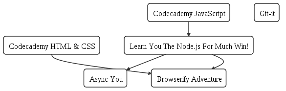

# Project no longer supported

progressionTree
===

A tool for self paced, self directed, learning. We model online "coures" as a dependency tree, showing students what they can accomplish with the knowledge they already have. The current state of this project is very much in beta.

I encourage you to look at _files/courses.json_, this file defines courses and their dependencies. We build a directed graph from this file and render it using node-webkit.

*Note* node-webkit doesn't like running on newer linux based operating systems. If you try running progressionTree and it crashes, try `./patchWebkit.sh`

# Project Structure

_files/_: Contains all configuration files for the project, including the definition of courses.
_modules/_: progressionTree is built generically, offloading most of the heavy lifting in launching and determining progress in courses off to plugins. These plugins are located in the _modules/_ directory.
